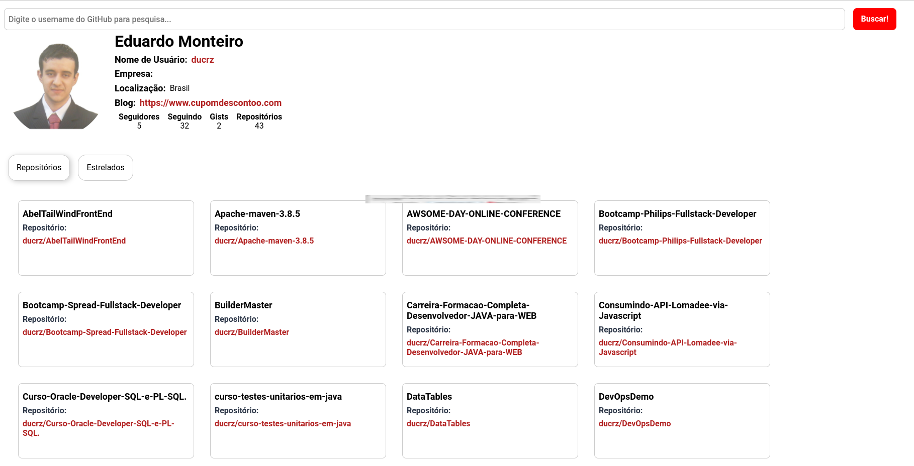

# Desafio de Projeto: Criando um front-end totalmente componentizado na prática com ReactJS

Desafio de Projeto do **Bootcamp Bootcamp Spread Fullstack Developer**, promovido pela [Digital Innovation One](https://www.dio.me).

## Descrição do Desafio

Agora é a sua hora! Crie uma solução com React que explore os conceitos apresentados nesse Desafio de Projetos. Para isso, você pode reproduzir o aplicação criada pelo expert ou, caso se sinta preparado, desenvolver algo do zero. Dica: você pode dar um "fork" no repositório disponibilizado pelo expert para organizar melhor as suas alterações e evoluções, mantendo uma referência direta ao código original.

**Desafio:** Criando um front-end totalmente componentizado na prática com ReactJS

## Ajustes feitos:

* Atualizações das dependências para versões atualizadas;
* Ajustando para PT-BR;
* Mudança de estilo via CSS;
* Criação de deploy de produção.

### Print da Tela do Desafio

