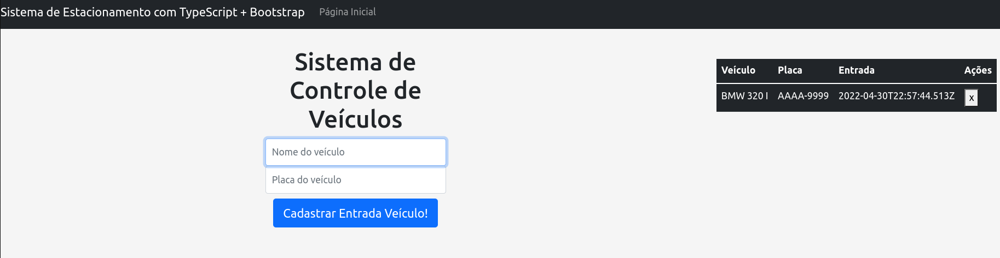

# Desafio de Projeto: Aprenda a Criar um Sistema de Estacionamento usando TypeScript

Desafio de Projeto do **Bootcamp Bootcamp Spread Fullstack Developer**, promovido pela [Digital Innovation One](https://www.dio.me).

## Descrição do Desafio

Você já se perguntou porque o Typescript está cada vez mais sendo utilizado entre os desenvolvedores? De que forma a tipagem de código pode tornar o desenvolvimento mais produtivo? Na aula de hoje vamos desenvolver um sistema básico de estacionamento em Typescript. Ao final dela você irá compreender o quão simples e poderoso é esse magnifico superset. 

**Desafio:** Criar um Sistema de Estacionamento usando TypeScript.

## Ajustes feitos:

* Uso do Bootstrap;
* Adoção do padrão MVC.

[Acesse aqui o Resultado do Desafio!](https://ducrz.github.io/Bootcamp-Spread-Fullstack-Developer/Desafios-de-Projeto/Sistema-de-Estacionamento-usando-TypeScript/estacionamento/view/index.html)

### Print da Tela do Desafio

